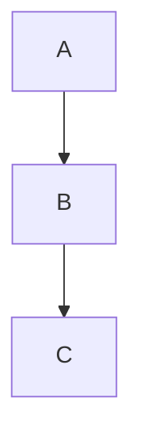
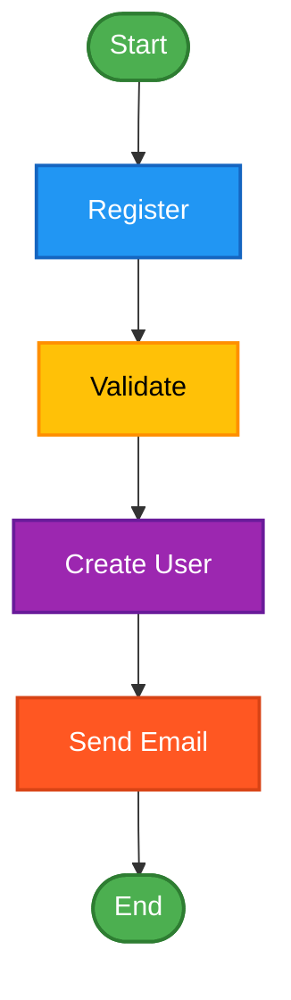

```mermaid
flowchart TD
A --> B
B --> C
```

```mermaid
flowchart TD

A([Start]) --> B[Register]
B --> C[Validate]
C --> D[Create User]
D --> E[Send Email]
E --> F([End])

style A fill:#4CAF50,stroke:#2E7D32,stroke-width:2px,color:#fff
style B fill:#2196F3,stroke:#1565C0,stroke-width:2px,color:#fff
style C fill:#FFC107,stroke:#FF8F00,stroke-width:2px,color:#000
style D fill:#9C27B0,stroke:#6A1B9A,stroke-width:2px,color:#fff
style E fill:#FF5722,stroke:#D84315,stroke-width:2px,color:#fff
style F fill:#4CAF50,stroke:#2E7D32,stroke-width:2px,color:#fff
```